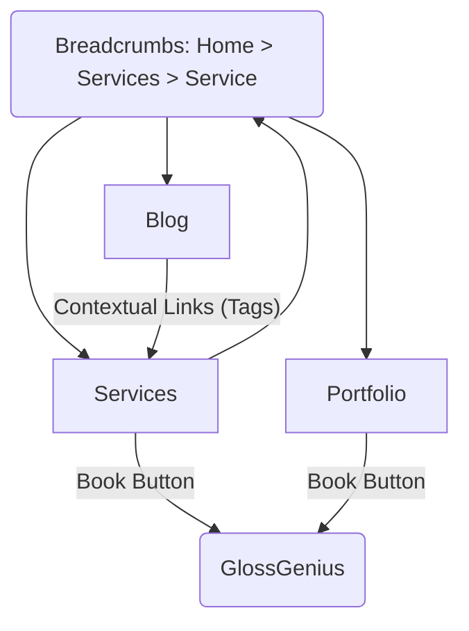

# Internal Linking Strategy Map

This document outlines the internal linking structure implemented to improve SEO and user flow.

## 1. Content Relationships

### Blog Posts → Services
**Goal**: Drive informational traffic (blog readers) to transactional pages (services).

**Implementation**:
- **File**: `app/blog/[slug]/page.tsx`
- **Logic**: Automatic matching based on tags.
  - If a Blog Post tag overlaps with a Service tag (case-insensitive).
  - OR if a Blog Post tag matches a Service Title.
- **Display**: A "Related Services" section appears at the bottom of the blog post, before the final CTA.

**Tagging Strategy for Editors**:
To ensure a blog post links to a specific service, include the service name or its key characteristics in the blog post's `tags` frontmatter.

| Service Slug | Service Title | Trigger Tags (Examples) |
|--------------|---------------|-------------------------|
| `ombre-powder-brows` | Ombre Powder Brows | "ombre", "powder brows", "shading", "oily skin", "cover-ups" |
| `nano-brows` | Nano Brows | "nano", "nano brows", "hair strokes", "dry skin", "natural" |
| `annual-touch-up` | Annual Touch-up | "touch up", "maintenance", "refresh" |

### Services → Booking
**Goal**: Convert interest into appointments.

**Implementation**:
- **File**: `app/services/[slug]/page.tsx`
- **Mechanism**: `ExternalBookingLink` component.
- **Placement**: 
  - Sidebar (Desktop)
  - Bottom of content (Mobile/All)

### Portfolio → Booking
**Goal**: Convert visual proof into appointments.

**Implementation**:
- **File**: `app/portfolio/page.tsx`
- **Placement**: Large CTA section after the gallery grid.

## 2. Global Navigation

- **Navbar**: Links to Home, About, Services, Portfolio, Blog, Contact, and a "Book Now" CTA.
- **Footer**: Links to all major pages + Socials.

## 3. URL Structure

- **Base**: `https://eyebrowsbygg.com`
- **Services**: `/services/[slug]` (e.g., `/services/nano-brows`)
- **Blog**: `/blog/[slug]` (e.g., `/blog/what-is-microblading`)
- **Portfolio**: `/portfolio`
- **Static**: `/about`, `/contact`

## 4. Visual Flow

